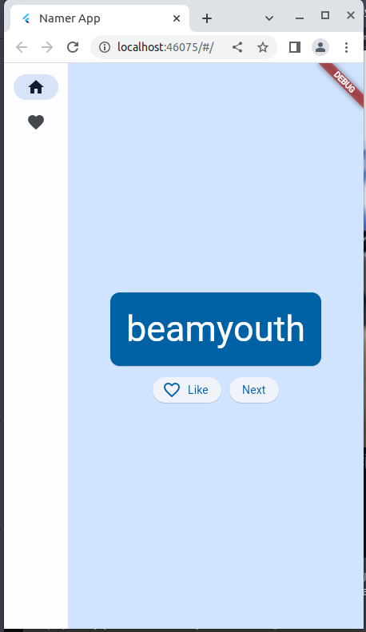

# Favorites Words App

---

# What i learned?

- "Remember: failing is okay, and is one of the most important elements of learning. Nobody expects you to nail Flutter development in your first hour, and neither should you."

**- Flashcards questions - Checklist**

- How NavigationRail works?
- How ChangeNotifier Widget works? ChangeNotifier, which means that it can notify others about its own changes.
- How to check Type In Flutter? (not tipped language)
  print(appState.runtimeType);
- How to Extract Widget in Flutter? Why?
- How Safe Area Widget works?

**- English flashcards - Checklist**

- foray: incursão
- lump: caroço
- tweak: puxão
- ">" = greater than
- "<" = less than (ins't lower then)
- "[" / "]" - opening/closing SQUARE bracket
- "{" / "}" - opening/closing CURLY bracket
- lumped: amontoado (amontoar)
- constraints: restrições
